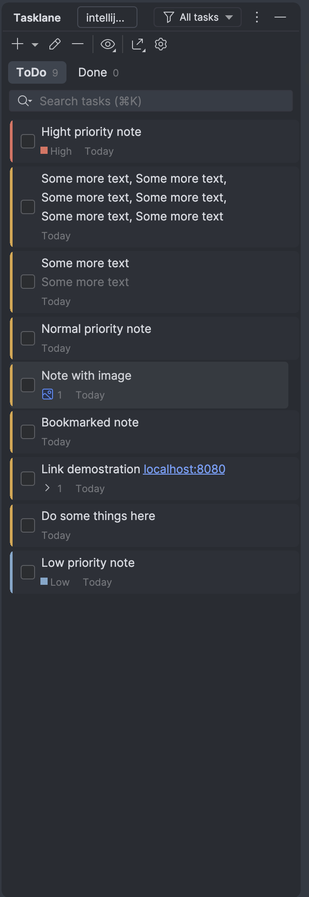
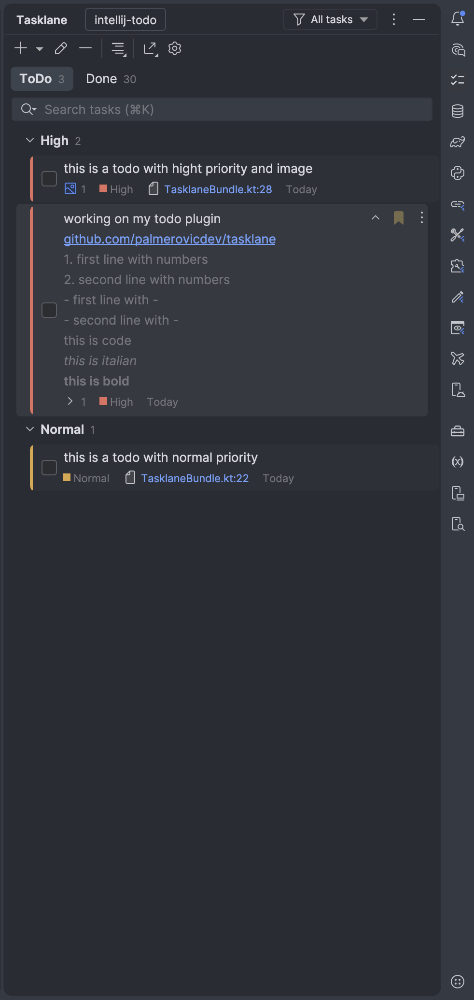
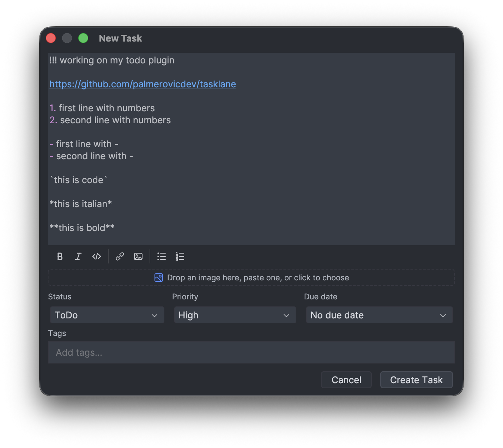
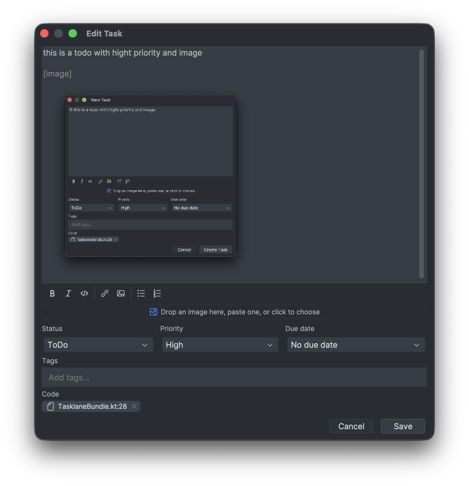
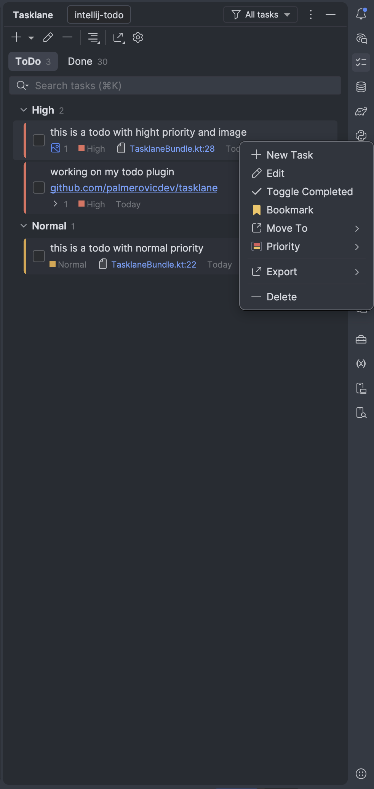
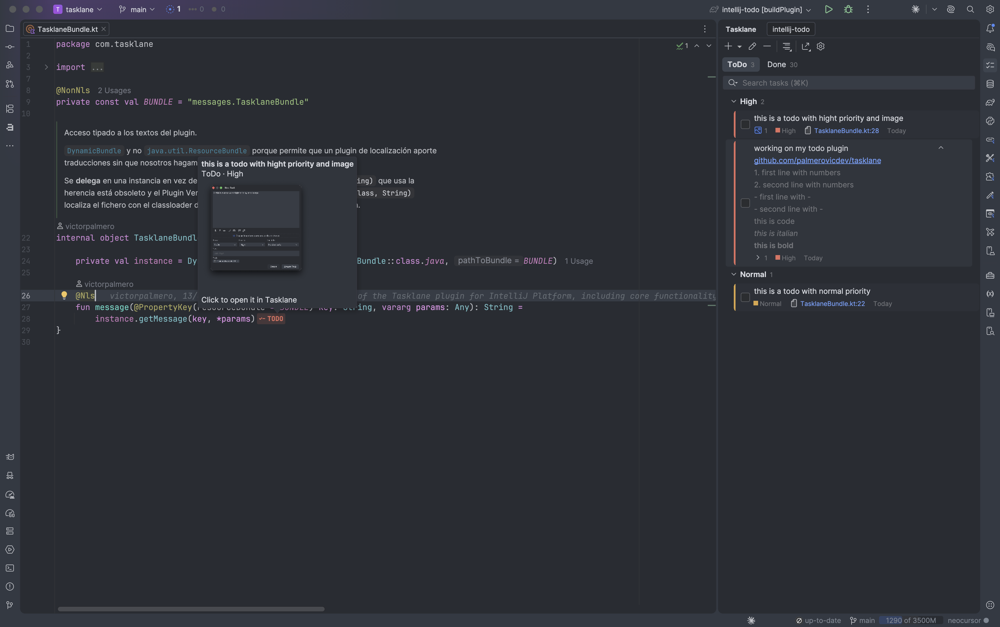
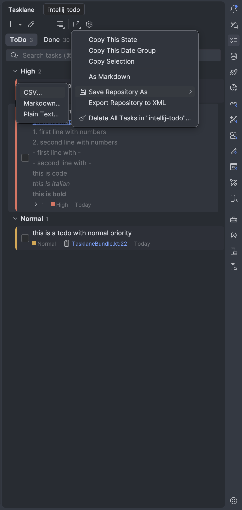
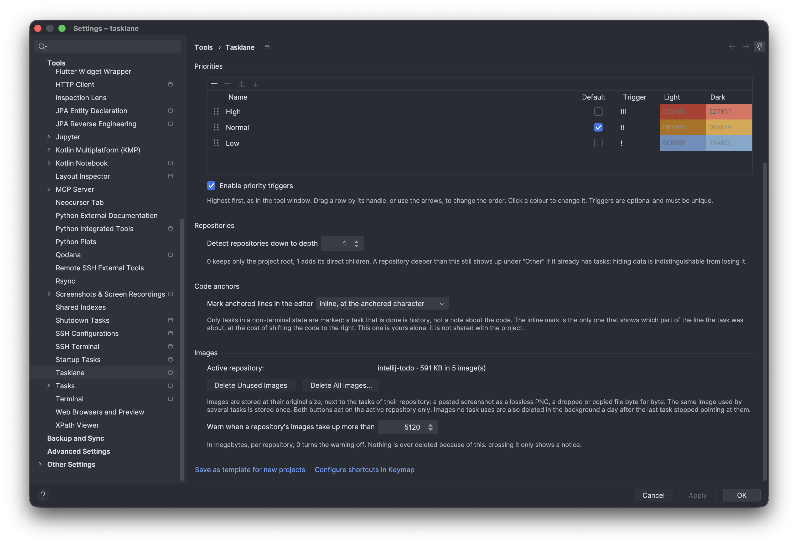

<div align="center">


# Tasklane

**Los TODOs viven donde vive el código.** Un plugin de IntelliJ Platform que guarda una
lista de tareas por repositorio dentro del propio proyecto: sin cuenta, sin servidor y
sin una sola llamada de red.

</div>

<div align="center">
  
</div>

<div align="center">
  
  &nbsp;&nbsp;
  
</div>

<div align="center">
  
  &nbsp;&nbsp;
  
</div>

<div align="center">
  
</div>

<div align="center">
  
  &nbsp;&nbsp;
  
</div>

---

Está hecho para las notas que se toman **mientras** se programa: las que nunca
sobreviven al viaje hasta un gestor externo. Se abre una Tool Window, se escribe, y se
queda ahí — en `.idea/tasklane/`, junto al código al que se refiere.

| | |
|---|---|
| **Estados como pestañas** | Con su recuento en vivo, que respeta la búsqueda y el filtro. Cada pestaña recuerda su selección y sus grupos plegados, y la última abierta vuelve al reabrir |
| **Una tarjeta por tarea** | Franja de prioridad, casilla para completar, título en hasta tres líneas, una línea del cuerpo y distintivos: prioridad, anclas de código, vencimiento, etiquetas, enlaces e imágenes, y fecha |
| **Markdown en la tarjeta** | Negrita, cursiva, `código` y tachado con su estilo y sin las marcas, y bloques de código entre vallas con la fuente del editor; las tareas cerradas salen tachadas |
| **Enlaces de un clic** | En el título y en cualquier línea del cuerpo, también en la gris. Acortados al pintarse, enteros al abrirse; el contador los lista todos |
| **Desplegar la tarjeta** | Para leer el cuerpo entero y ver sus capturas sin salir de la lista; un clic en una captura la amplía |
| **Ver una captura mientras programas** | La ventana de una captura ampliada se **fija** con la chincheta de su cabecera: se queda encima del editor y deja de cerrarse al pulsar fuera |
| **Seleccionar y copiar** | El texto de la tarjeta se marca con el ratón y se copia con `⌘C` |
| **Cambiar la prioridad de un clic** | Desde su distintivo en la tarjeta, o para toda la selección con *Priority ▸* |
| **Mover de estado sin diálogo** | *Move To ▸* o `⇧⌥←/→`, también sobre una selección |
| **Marcar** | Sube la tarea al principio de su grupo, sea cual sea su prioridad |
| **Operaciones sobre muchas** | Completar, marcar, mover, cambiar la prioridad o borrar una selección es una sola operación; por encima de diez tareas va en segundo plano y cancelar lo deshace. Borrar se deshace con *Undo* o `⌘Z` |
| **Agrupar y plegar** | Por fecha —hoy y un grupo por día—, por prioridad o por etiqueta, elegido por estado; cada cabecera se pliega |
| **Filtrar la vista** | Todas, abiertas, vencidas o marcadas, sumado a la búsqueda |
| **Buscar con operadores** | En el cuerpo entero, sin distinguir mayúsculas ni acentos, ordenado por relevancia: `state:` `p:` `repo:` `is:` `has:` `file:` `#tag`. También desde `⇧⇧` |
| **Archivar lo terminado** | Esconder lo cerrado hace más de N días, con el pie de la lista diciendo cuántas y un enlace para verlas |
| **Escribir en Markdown** | Un mismo diálogo para crear y editar, con barra de formato, listas, enlaces e imágenes que se pegan, se sueltan o se eligen |
| **Listas de comprobación** | `- [ ] algo` se pinta como casilla y se marca con un clic desde la tarjeta |
| **Orden manual** | Por estado: arrastrar por el asa de la tarjeta o `⌘⇧↑/↓` |
| **Vencimiento y etiquetas** | Preajustes o calendario; lo vencido se pinta en rojo y **un aviso dice** qué vence hoy o ya venció. Etiquetas como fichas |
| **Triggers de prioridad** | `!!! Arreglar el login` crea la tarea con prioridad *High* |
| **Apuntar al código** | Una tarea se ancla a `fichero:línea:columna` desde el menú contextual del editor, o escribiendo `plans/deploy.md:28` en el diálogo —con autocompletado de rutas—, y la tarjeta lleva de vuelta con un clic |
| **Los TODO del código, a Tasklane** | `Alt+Enter` sobre un `// TODO` lo pasa a una tarea anclada y quita el comentario; *Import TODO Comments…* importa todos los del proyecto sin tocar el código |
| **El código enseña sus tareas** | Una marca en el margen o una pastilla en la línea, con el color de la prioridad, un tooltip con la tarea y un clic que la abre |
| **Una lista por repositorio** | Varios repositorios Git en la misma ventana, cada uno con sus tareas, un selector, y búsqueda en todos a la vez |
| **Tareas para agentes de IA** | Con el servidor MCP del IDE encendido, Claude Code, Junie o cualquier cliente MCP leen la lista, abren una tarea con sus anclas en la línea de hoy, apuntan lo que dejan pendiente, marcan la checklist y la cierran al terminar |
| **Crear desde cualquier sitio** | `⌘⌥R` abre el diálogo sin pasar por la Tool Window |
| **Copiar al portapapeles** | Markdown o texto plano; un estado, un grupo —como parte del día— o sólo la selección |
| **Guardar y vaciar un repositorio** | Todas sus tareas a un CSV, un Markdown o un texto plano; y, por separado, borrarlas todas |
| **Exportar a XML y quitar repositorios** | La salida al formato de intercambio, y quitar un repositorio que ya no está en disco comprobando antes que salieron todas |
| **Imágenes a su tamaño** | Guardadas sin duplicar, con miniaturas en la lista, su peso a la vista, limpieza en un botón y aviso por umbral |
| **Configurable por proyecto** | Estados y prioridades con nombre, orden arrastrando, colores, triggers y agrupación; plantilla para proyectos nuevos |
| **Datos a salvo** | Base local, copia diaria, comprobación tras un cierre inesperado, reparación automática de una base dañada y *Tasklane: Diagnostics* |
| **Teclado y accesibilidad** | La ventana se maneja entera con el teclado, y lista, buscador y diálogo tienen nombre para un lector de pantalla |
| **Hecho para listas enormes** | Un millón de tareas se abren, se buscan y se recorren sin congelar el IDE |

- **Repositorio:** [palmerovicdev/tasklane](https://github.com/palmerovicdev/tasklane)
- **Arquitectura y decisiones:** [`docs/architecture.html`](docs/architecture.html)
- **Historial de versiones:** [`CHANGELOG.md`](CHANGELOG.md)
- **Licencia:** [MIT](LICENSE)

## Instalación

Desde el IDE: *Settings → Plugins → Marketplace*, buscar **Tasklane**.

O con el zip, que es lo que produce este repositorio:

```bash
./gradlew buildPlugin          # -> build/distributions/tasklane-2.12.0.zip
```

*Settings → Plugins → ⚙ → Install Plugin from Disk…*

Necesita IntelliJ IDEA 2026.1.5 o posterior —cualquier IDE de la plataforma— y Java 21.
Git es opcional: sin él, la raíz del proyecto hace de repositorio único.

## Qué se versiona y qué no

| Fichero | Qué hay | VCS |
|---|---|---|
| `.idea/tasklane.xml` | estados y prioridades del proyecto | **sí** — compartible con el equipo |
| `.idea/tasklane/tasklane.db` | las tareas, en una base SQLite local | no — la carpeta lleva su propio `.gitignore` con `*` |
| `.idea/tasklane/tasklane.db.backup` | la copia diaria de la base | no |
| `.idea/tasklane/tasklane.db.corrupt-<fecha>` | una base dañada que se reparó; se conserva y se puede borrar a mano | no |
| `.idea/tasklane/repos/<repo>/attachments/` | las imágenes de cada repositorio | no |
| `.idea/tasklane/layout.xml` | el registro de repositorios | no |
| `workspace.xml` | tus preferencias: pestaña abierta, filtro, repositorio activo, buscar en todos, formato de copia, marca del editor, aviso de vencimientos y archivo de lo terminado | no |
| `tasklane-defaults.xml` (config del IDE) | plantilla para proyectos nuevos | n/a — es lo único que roamea |

Un proyecto sin `.idea/tasklane.xml` se siembra desde la plantilla al abrirse, así que
configurar por proyecto no obliga a reconfigurar cada proyecto.

**Una copia de seguridad al día, como mucho.** Las tareas viven en
`.idea/tasklane/tasklane.db`, y a su lado queda `tasklane.db.backup`: una copia entera y
compacta que se rehace en segundo plano si pasó un día y hubo cambios. Si el IDE se cerró
de golpe, la apertura siguiente además **comprueba la base**; si encuentra daños deja de
escribir en ella y de copiar encima de la última copia buena, y al reabrir **la repara**:
aparta el fichero dañado como `tasklane.db.corrupt-<fecha>`, rescata todo lo que se deja leer
y sólo pide a la copia lo que no. Ver [Datos y seguridad](#datos-y-seguridad).
*Tasklane: Diagnostics* enseña la copia, la última comprobación y la última reparación.

## Repositorios

Cada repositorio de la ventana tiene su propio conjunto de tareas. No se escanea el
disco buscando carpetas `.git`: el modelo lo mantiene el IDE y se lee de ahí.

| | |
|---|---|
| Con Git | Los repositorios registrados en el VCS del proyecto, submódulos incluidos |
| Sin Git (o con el plugin desactivado) | Pseudo-repositorio sobre la raíz del proyecto |
| Uno añadido en caliente | Aparece sin reiniciar, por el evento de *mappings* |
| Un solo repositorio | El selector se esconde y el nombre va al título de la ventana |

**Profundidad.** Por defecto sólo cuentan los hijos directos de la raíz
(*Settings → Tools → Tasklane → Repositories*). Es un filtro de vista, no un borrado:
un repositorio más profundo que ya tenga tareas nunca se oculta, aparece bajo «Other».
Lo mismo con una carpeta que desaparece del disco — se marca como ausente, pero se
puede abrir y sus tareas siguen ahí. Esconder datos es indistinguible de perderlos.

**Claves.** El directorio de cada repositorio es
`slug(ruta relativa)-sha256(esa ruta).take(8)` — `backend-api-a3f91d0e` — y la raíz
del proyecto se queda con `root`. Al ser relativa, mover el proyecto entero no cambia
ninguna clave. Renombrar un subrepositorio sí, y sus tareas quedan accesibles bajo la
entrada ausente, de donde salen con «exportar y quitar» (ver más abajo).

## La ventana

Los estados son una fila encima del buscador, cada uno con el recuento de lo que
enseña (`ToDo 2`). El número sale de la misma cuenta que la lista, así que respeta la
búsqueda y el filtro: nunca dirá `3` sobre una lista de dos. Cambiar de estado no
reconstruye nada —cada uno conserva su árbol, su selección y sus grupos plegados— y el
que estaba abierto se recuerda al reabrir el proyecto.

| Control | Qué hace |
|---|---|
| *New Task* (botón partido) | El cuerpo crea en la pestaña activa; la flecha deja elegir otro estado destino sin cambiar de pestaña |
| *Edit* / *Delete* | Abren la tarea seleccionada / borran la selección. También con `Enter` y `Supr` |
| *Group By* | Cómo agrupa esta pestaña: sin agrupar, por fecha, por prioridad o por etiqueta |
| *Search All Repositories* | Busca en todos los repositorios de la ventana. Sólo aparece si hay más de uno |
| *Export* | Copiar al portapapeles, guardar el repositorio, exportarlo a XML, vaciarlo y quitar uno ausente. Ver [Exportación](#exportación) |
| *Settings* | Abre *Settings → Tools → Tasklane* |
| Selector de repositorio | En la cabecera de la ventana. Con un solo repositorio se esconde y su nombre va al título |
| Filtro de vista | *All tasks* / *Open* / *Overdue* / *Bookmarked*, en la cabecera. Es de la ventana entera y se recuerda en `workspace.xml` |
| Marcador y `⋮` | A la derecha de cada fila, junto al botón de desplegar. Aparecen con el ratón encima —el marcador, siempre que la tarea lo esté— y el menú es el mismo del clic derecho |

Los estados estuvieron en la barra de pestañas del IDE hasta la `0.6.1`; se bajaron al
panel porque en el header competían con el título, el selector de repositorio y el
filtro. El precio es que `Alt+←/→` ya no cambia de estado.

El filtro **no** es una consulta: no se escribe, no tiene sintaxis y borrar la búsqueda
no se lo lleva por delante. Son dos cosas que se acumulan —«vencidas» *y* lo que diga
el campo—, y por eso el desplegable está en la cabecera y no dentro del campo.

**Listas enormes.** La lista se carga a páginas de cincuenta y anuncia lo que queda
—«4.213 more»—: llegar a esa fila desplazándose, pulsarla o `Enter` sobre ella trae la
siguiente. Un grupo de más de 500 tareas empieza plegado, y todo lo que crece con el número
de tareas —contar, agrupar, buscar— ocurre fuera del hilo de interfaz. Con 100.000 tareas,
la lista de un proyecto se abre en unos 9 ms.

### La tarjeta

Cada tarea es una tarjeta de altura variable: crece con lo que tenga que decir y una
tarea de una frase sigue midiendo una línea.

| Parte | Cuándo aparece |
|---|---|
| Franja de color a la izquierda | Siempre — es la prioridad, dentro de la tarjeta y recortada por ella |
| Casilla | Siempre. Marcarla lleva la tarea al estado terminal; desmarcarla, al de por defecto |
| Título | Hasta **tres** líneas; lo que no cabe se recorta. Una tarea cerrada sale tachada. Doble clic o `Enter` abre la tarea entera |
| Descripción | Si hay cuerpo bajo el título. Una línea, recortada |
| Distintivos | La **prioridad** siempre —un clic abre la lista de prioridades—, las **anclas** de código —un clic lleva al código—, el **vencimiento** —en rojo si ya pasó—, las **etiquetas**, el contador de **enlaces** —un clic los lista— y el de **imágenes** —un clic las amplía, y pararse encima las enseña— y la **fecha**. Buscando en todos los repositorios, además, el del que viene la fila |
| Desplegar | Un chevrón a la derecha, sólo si la tarjeta esconde algo: título largo, más cuerpo o capturas |
| Marcador y menú `⋮` | A la derecha, con el ratón encima; el marcador se queda visible en las tareas marcadas |

**Con la ventana estrecha nada importante se cae.** Si el distintivo de prioridad o el de un
ancla no caben enteros, se quedan en su icono —el punto de color, el icono de fichero—, que
responde al clic igual. Está garantizado hasta el ancho mínimo de la ventana, 300 px; lo
que sí se queda fuera cuando no cabe es lo demás, empezando por lo menos importante.

**Desplegada**, la tarjeta deja de resumir: el título entero, todas las líneas del cuerpo y
sus imágenes, cada una detrás de la línea que la nombra. Un clic en una imagen la abre a
tamaño de pantalla —y esa ventana se puede **fijar**, ver más abajo—. El texto de la
tarjeta se **selecciona con el ratón** y se copia con `⌘C`; `Escape` quita la selección.

El título y la descripción se pintan **en Markdown**: `**negrita**`, `*cursiva*`,
`` `código` `` y `~~tachado~~` salen con su estilo y sin las marcas. Los guiones bajos
no son cursiva a propósito —`un_nombre_asi` es identificador mucho más a menudo—, y
`2 * 3 * 4` sigue siendo una multiplicación.

Los enlaces se abren con **un clic** desde la tarjeta, sin entrar a editar, estén en el
título o en cualquier línea del cuerpo; el doble clic sigue siendo «abrir la tarea» en todo
lo demás. Toda la tarjeta responde al ratón, no sólo la parte con letras.

### Trabajar con tareas

El **menú contextual** —el mismo que el `⋮` de la fila— tiene *New Task*, *Edit*,
*Toggle Completed*, *Bookmark*, *Move To ▸*, *Priority ▸*, *Export* y *Delete*.

- **Todo vale sobre una selección múltiple**: completar, marcar, mover, cambiar la
  prioridad y borrar. Muchas tareas a la vez son **una** operación y un repintado; por
  encima de diez va en segundo plano con barra, y **cancelar la deshace entera**.
- **Mover de estado sin diálogo** con *Move To ▸*, o de pestaña en pestaña con `⇧⌥←/→`.
- **Cambiar la prioridad** de la selección con *Priority ▸*, cada entrada con su color.
- **Borrar** con `Supr` o *Delete*. No pregunta, y **se deshace**: sale un aviso
  *«3 tasks deleted — Undo»*, y `⌘Z` con el foco en la lista devuelve lo último que se
  borró, tal como estaba —mismas fechas, mismo sitio, mismas imágenes—. Hasta 10.000
  tareas de una vez; por encima el aviso dice que no hay vuelta.
- **Entrar en un estado terminal** —*Done* de fábrica— apunta la fecha de cierre, que es
  la que usa *Done* para agrupar por fecha.
- **Listas de comprobación.** Una línea `- [ ] algo` en el cuerpo se pinta en la tarjeta
  como una casilla de verdad, del tamaño de una letra y azul al marcarla, —también si es el título—, y **un clic la marca**: escribe la `x` en el
  cuerpo, y lo marcado sale tachado. La línea de distintivos cuenta cuántas van
  (`☑ 2/5`), porque plegada la tarjeta sólo enseña la primera. En el diálogo, el botón
  *Checklist* convierte en casillas las líneas seleccionadas.

### Orden manual

Cada estado puede ir **a mano**: *Group By ▸ Manual Order*. Entonces la lista deja de
ordenarse por prioridad y fecha y sigue el orden que se le dé:

- **Arrastrando la tarjeta por su asa** (⋮⋮), que sale al pasar el ratón a la derecha,
  a media altura bajo el marcador y el menú —un hueco que la tarjeta siempre
  dejaba libre, así que no le quita sitio a nada—. El resto de la tarjeta sigue sirviendo
  para seleccionar texto.
- **Con `⌘⇧↑/↓`**, las teclas de *Move Line Up/Down*, o *Move Up* / *Move Down* del menú
  contextual.
- Al pasar a mano **la lista no se mueve**: su orden empieza siendo el que se veía.
- Lo marcado sigue arriba, las tareas nuevas entran arriba del todo, y la agrupación
  sigue valiendo: se ordena dentro de cada grupo, y soltar en otro grupo no hace nada.
- Buscando manda la relevancia, así que mientras hay búsqueda no se arrastra.
- Es del estado, como la agrupación, y se guarda en `tasklane.xml`.

### Archivar lo terminado

*Done* sólo crece. En *Settings → Tools → Tasklane → Completed tasks* se puede **esconder
lo que se cerró hace más de N días** —un mes, si se marca sin tocar el número—; sin marcar
se ve todo, que es lo de fábrica.

- Sólo en los estados **terminales**, y sólo en la lista: la pestaña cuenta lo que
  enseña, y **buscar sigue encontrándolo todo**, que es la forma de llegar a una tarea
  vieja.
- **Nunca en silencio**: el pie de la lista dice cuántas se esconden —*«128 tasks
  completed more than 30 days ago are hidden. Show»*— y *Show* las enseña hasta cerrar el
  proyecto. Esconder datos sin decirlo es indistinguible de perderlos.
- Ir a una tarea archivada —desde `⇧⇧` o una marca del editor— las enseña también.
- Una tarea terminal sin fecha de cierre, de antes de que se sellara, se ve siempre: lo
  que no se puede fechar no se puede dar por viejo.
- Es de cada uno y va a `workspace.xml`, como el filtro de vista.

### Agrupar

Cuatro formas, elegidas en el desplegable de la barra y recordadas **por estado**
—*ToDo* puede agrupar por fecha y *Done* por prioridad—:

| | |
|---|---|
| Sin agrupar | Lo marcado arriba, luego por prioridad, y dentro de cada una lo más reciente. O a mano: ver [Orden manual](#orden-manual) |
| Por fecha | *Today* y, debajo, **un grupo por cada día con alguna tarea** —*Sep 14*, *Sep 10, 2025*—, y *No date* al final, contra la fecha que el estado ancle (creación, modificación o cierre) |
| Por prioridad | De la más alta a la más baja, y sólo las que tengan algo |
| Por etiqueta | Una tarea con dos etiquetas sale bajo las dos; las que no tienen ninguna, en un grupo al final |

Cada cabecera lleva un chevrón y **se pliega con un clic** —o con `←`/`→` desde el
teclado—. Lo plegado se recuerda por grupo, no por posición, así que repintar la lista
no lo pierde.

Agrupando por fecha, **«hoy» se enseña aunque esté vacío** —*No tasks today · You're all
caught up!*, o *Nothing completed today* en un estado terminal—: que no haya nada hoy es
justo lo que se viene a mirar. Sólo ése, y sólo si la lista tiene algo más y no hay
búsqueda ni filtro.

### El diálogo de tarea

**El mismo para crear y para editar**, venga de *New Task*, del doble clic, de Quick Add o
del editor: una tarea apuntada de prisa no nace distinta de una escrita con calma.

| | |
|---|---|
| Cuerpo | Markdown. La primera línea con texto es el título |
| Barra de formato | Negrita, cursiva, código, enlace, imagen, lista con viñetas, lista numerada y lista de comprobación |
| Imágenes | Se pegan, se sueltan en la zona de abajo o se eligen del disco. Ver [Imágenes](#imágenes) |
| Estado y prioridad | Desplegables; el estado sale de la pestaña desde la que se abrió |
| Vencimiento | Preajustes o calendario propio |
| Etiquetas y código | Fichas; las del código son las anclas de la tarea |
| `Escape` | Cierra el diálogo aunque el cursor esté dentro del cuerpo |

### Vencimiento, etiquetas y marcadores

Los tres se editan en el diálogo de la tarea y son campos del modelo, no texto del
cuerpo: no hay forma de teclear «esto vence el viernes» sin inventar una sintaxis.

- **Vencimiento** por preajustes —hoy, mañana, final de la semana, la semana que viene— o
  con una fecha concreta del calendario. Vence al **acabar** el día, así que algo
  puesto para hoy no nace vencido. Pasada la fecha, la tarjeta lo pinta en rojo.
- **Aviso de vencimientos**: *«2 overdue · 1 due today in backend»*, del repositorio
  activo, con *Show* para ir a ellas. Sale al abrir el proyecto, al cambiar de
  repositorio y cada media hora, y sólo si hay algo de lo que no se haya avisado ya hoy.
  Se apaga desde el propio aviso o en *Settings → Tools → Tasklane → Due dates*; es
  preferencia de cada uno y va a `workspace.xml`.
- **Etiquetas** como fichas: se escriben separadas por coma o espacio y se quitan con
  su aspa, o con `Retroceso` desde el campo vacío. En el buscador son `#api`.
- **Marcador**: sube la tarea al principio de su grupo pase lo que pase, porque
  marcar es precisamente decir «que no se me pierda esto». Se pulsa en la propia fila.

## Anclas de código

Una tarea puede decir **de qué trozo de código habla**. Es la diferencia entre una lista
de tareas dentro del IDE y una lista de tareas *del* IDE: hasta la `1.0.0` las tareas
vivían junto al código pero no apuntaban a él, y volver a «¿dónde era esto?» era trabajo
de quien escribió la nota.

*New Tasklane Task from Here*, en el **menú contextual del editor** y en el menú **Tools**,
abre el diálogo de siempre con el sitio ya puesto. Si hay algo seleccionado, ese texto entra
como cuerpo. Con un fichero seleccionado en la vista del proyecto en vez de un editor, la
tarea apunta al fichero.

| | |
|---|---|
| Qué se guarda | La ruta **relativa a la raíz del proyecto**, la línea, la columna, y el texto de esa línea |
| En la tarjeta | Un distintivo `Auth.kt:42` con color de enlace. Un clic abre el fichero por ahí —en la línea y el carácter exactos—; la ruta entera va al tooltip. Si no cabe entero se queda en su icono, que lleva al mismo sitio |
| En el editor | La línea marcada, con el color de la prioridad. Ver [La marca en el editor](#la-marca-en-el-editor) |
| Quitarla | En el diálogo de la tarea, con el aspa de su ficha. No se pueden añadir a mano: un ancla es un sitio del editor, y teclear una ruta y un número es lo que esto viene a evitar |
| Buscar | `file:AuthService` por un trozo de la ruta, `has:code` por tenerla. La ruta entra además en el texto libre |

**La ruta es relativa al proyecto, no al repositorio de la tarea.** Por lo mismo que las
claves de repositorio: mover el proyecto entero no rompe ninguna ancla. Y una tarea de
`backend` puede apuntar perfectamente a un fichero de `frontend` — obligar a que no
fuera así convertiría una anotación en una regla.

**Un número de línea envejece solo**, así que no se guarda a secas: junto a él va el
texto de la línea, y al abrir el ancla se busca ese texto **hacia fuera** desde donde
estaba, ganando la coincidencia más cercana. Un import de más, resangrar el bloque o
mover la función unas líneas no rompen nada. Si la línea desapareció del todo, el
fichero se abre igualmente por donde estaba: el contexto de alrededor dice enseguida si
la nota sigue teniendo sentido. Y si el fichero ya no existe, se avisa — un clic que no
hace nada se lee como un fallo del plugin.

### La marca en el editor

Y el código, a su vez, enseña sus tareas. Una línea con tarea va marcada con el logo de
Tasklane **en el color de su prioridad**; el ratón encima abre un tooltip con el título,
el estado, la prioridad, el vencimiento, las etiquetas y **las capturas de la tarea**, y
un clic lleva a la tool window con esa tarea seleccionada — cambiando de repositorio si
la tarea es de otro.

Las capturas salen sólo en la pastilla inline, y por una razón concreta: su tooltip se
construye al pasar el ratón y en un hilo de fondo, así que puede ir al disco. El del
margen lo calcula la plataforma para todas las anclas del fichero a la vez y en el EDT,
donde leer imágenes congelaría el editor. Media tarea es una imagen pegada, y mirarla ya
suele ser la respuesta: obligar a abrir la ventana justo ahí era el peor momento.

| | |
|---|---|
| Qué se marca | Sólo lo que sigue **abierto**. Una tarea en un estado terminal es historia, no una nota sobre el código: marcarla convertiría el margen en un cementerio |
| Varias en la misma línea | Una sola marca, con el logo entero —dos renglones— y el color de la de más prioridad. El tooltip las lista |
| Dónde se elige | *Settings → Tools → Tasklane → Code anchors*. Es un ajuste **tuyo**: va a `workspace.xml`, no se comparte con el equipo |

Hay dos formas, y ninguna es buena para todo el mundo:

- **Icono en el margen** (lo de fábrica). No toca ni un píxel del código, y vive donde ya
  viven los puntos de interrupción y el *Run* de un test. Sólo sabe de líneas.
- **Pastilla en el texto**, `✓ TODO`. Es la única que enseña **de qué parte de la línea**
  hablaba la nota — `cache.get(key) ?: load(key)` son dos cosas en el mismo sitio—, a
  cambio de empujar el código a la derecha. La palabra es **el nombre del estado en
  mayúsculas**, como un marcador de código de toda la vida: con la configuración de
  fábrica sale `TODO`, y una tarea en *Doing* dice `DOING` en vez de mentir. Deja aire a
  los dos lados para que el código no entre y salga de ella; ese hueco es del inlay, no
  del fichero, que es justo lo que un inlay existe para no tocar.

La línea se vuelve a buscar por su texto al abrir el fichero, igual que al pulsar el
distintivo de la tarjeta; a partir de ahí la marca sigue al código mientras se edita. Y
las marcas las pone el **modelo**, no el analizador del IDE: mover una tarea a *Done*
apaga la suya en ese momento, no en el siguiente pase — y funcionan igual en un `.txt`
que en un `.kt`.

## Quick Add

`⌘⌥R` abre **el mismo diálogo** que *New Task*, desde cualquier sitio del IDE y sin
pasar por la Tool Window. Hasta la `0.6.7` abría un popup compacto propio: se escribía
más rápido, pero tenía la mitad de los campos —sin vencimiento, sin etiquetas, sin
barra de formato ni vista previa de las imágenes—, así que una tarea apuntada de prisa
nacía distinta de una escrita con calma. La tarea se crea en el **repositorio activo**,
el mismo que usa *New Task*.

**Triggers.** Escribir `!!! Resolver el fallo` crea la tarea *Resolver el fallo* con
prioridad *High*: el prefijo mueve el desplegable de prioridad mientras se escribe y
**no se guarda**. Gana la coincidencia más larga y hace falta un espacio detrás, así
que `!importante revisar` no dispara nada; borrarlo devuelve la prioridad anterior y
elegirla a mano gana sobre el prefijo. Funcionan **sólo al crear**: sobre una tarea que
ya existe el desplegable está a un clic, y un cuerpo que empiece por `!!! ` no tiene
por qué perderlo sólo por haberlo abierto. Los prefijos se configuran por prioridad y
se apagan enteros desde *Settings → Tools → Tasklane*.

## Búsqueda

`⌘K` lleva el foco al campo, sobre el árbol. Se busca en el cuerpo entero, no sólo en
la fila, ignorando mayúsculas y acentos en los dos sentidos: *autenticación* encuentra
*autenticacion* y al revés. `Enter` guarda la consulta en el historial del campo y devuelve
el foco a la lista; `Escape` la borra.

| Operador | Ejemplo |
|---|---|
| Texto libre | `token refresco` — se piden todos los términos |
| `state:` | `state:doing`, `state:"In Review"` |
| `p:` | `p:high` |
| `repo:` | `repo:backend` |
| `is:` | `is:done`, `is:open` |
| `has:` | `has:link`, `has:image`, `has:code` |
| `file:` | `file:AuthService`, `file:main/kotlin` — por un trozo de la ruta anclada |
| `#tag` | `#api #urgente` — se piden todas las etiquetas |

Los valores son prefijos. Varios valores del mismo operador son un «o»; operadores
distintos se acumulan. Un operador a medio escribir (`state:`) se ignora en vez de
vaciar la lista, y un prefijo desconocido (`https:`) se busca como texto.

**Alcance.** Sólo el repositorio activo, salvo que se active *Search All Repositories*
en la barra — que sólo aparece cuando hay más de uno. Las filas de otro repositorio se
etiquetan con su nombre.

**Desde cualquier sitio, con `⇧⇧`.** Las tareas salen en *Search Everywhere*, en la
pestaña *All* y en una propia, *Tasklane*, con la misma sintaxis y el mismo alcance que el
buscador de la ventana. `Enter` abre la tool window con la tarea seleccionada, aunque
estuviera cerrada o archivada. Con la consulta vacía no enseña nada.

**Ordenado por relevancia.** Desde la `2.0.0` el texto va a un índice de texto completo
(FTS5) dentro de la base, que puntúa más un acierto en el título que en el cuerpo, y la
lista enseña los **200 mejores**. Sin texto libre —sólo operadores— manda el orden de
siempre. Todo ocurre fuera del hilo de interfaz y detrás de un *debounce* de 120 ms.

## Agentes de IA (MCP)

Desde la `2.12.0` las tareas son también herramientas del **servidor MCP que trae el
IDE**. Un agente conectado a él —Claude Code, Junie, AI Assistant, Cursor o cualquier
cliente MCP— puede recibir «haz la tarea de Tasklane sobre el login», leer la nota con sus
anclas, trabajar, ir marcando la lista de comprobación y cerrarla al terminar; o apuntar
en Tasklane lo que deja pendiente en vez de sembrar `// TODO` por el código.

**Cómo se enciende.** *Settings → Tools → MCP Server → Enable MCP Server*, y conectar el
agente desde esa misma página (el IDE configura solo los clientes que conoce). Tasklane
no abre ningún puerto ni tiene ajuste propio: sin el plugin *MCP Server* activo no se
carga nada de esto. Las herramientas pueden apagarse una a una desde los ajustes del
servidor.

| Herramienta | Qué hace |
|---|---|
| `tasklane_list_repositories` | Los repositorios con sus tareas abiertas, y los estados y prioridades configurados |
| `tasklane_list_tasks` | Sin consulta, lo abierto estado por estado y en el orden de la lista; con consulta, los aciertos por relevancia, con [la misma sintaxis](#búsqueda) que el buscador. `repository: "all"` busca en todos |
| `tasklane_get_task` | Una tarea entera: cuerpo Markdown, casillas numeradas, enlaces y anclas **en la línea de hoy** —`anchoredAtLine` si se movió, `missing` si el fichero ya no está— |
| `tasklane_create_task` | Crea una tarea, con estado, prioridad, etiquetas, vencimiento y anclas escritas como `src/Auth.kt:42` |
| `tasklane_update_task` | Cambia sólo lo que se le pasa; `dueDate: "none"` quita el vencimiento |
| `tasklane_complete_task` | La lleva al estado cerrado. Repetirla no la reabre |
| `tasklane_set_checklist_item` | Marca o desmarca la casilla N. Repetirla no la alterna |

Detalles que importan:

- **No hay herramienta de borrar**, a propósito. Un error completando se deshace
  reabriendo; uno borrando, no —los datos no van al VCS—. Borrar sigue siendo cosa de quien
  mira la lista, con su *Undo*.
- **Todo pasa por el mismo camino que la ventana**: lo que hace el agente aparece en la
  lista en el acto, y una base que se está recuperando o importando se niega a escribir
  con un error que lo dice.
- **Los nombres se escriben como se leen**: `doing`, `High`, `backend` —sin mayúsculas ni
  acentos, o un prefijo que encaje con uno solo—. Si no encajan, el error dice cuáles hay,
  para que el agente se corrija en la llamada siguiente.
- **Las anclas leen el disco, no la memoria del IDE.** Un agente edita los ficheros desde
  fuera y pregunta enseguida; antes de responder se refresca ese fichero, así que la línea
  que devuelve es la de después de su edición.
- Sin `repository`, el repositorio es el activo en la ventana. Con varios proyectos
  abiertos, el propio servidor pide al agente que diga cuál.

## Enlaces

Las URLs del cuerpo se extraen **al escribir** y se guardan derivadas en la tarea, así
que pintar una fila nunca ejecuta una expresión regular. Se reconocen las URLs
sueltas, las que empiezan por `www.` y los enlaces Markdown `[texto](url)`.

| | |
|---|---|
| En el título | El enlace se pinta con el estilo de enlace del IDE y se abre con un clic |
| En el cuerpo | Sobre su propia línea, con el mismo estilo de enlace aunque el texto vaya en gris |
| Contador | El icono de cadena de la línea de distintivos, con el número; con varios enlaces sale una lista de todos |
| Acortado | `https://youtrack.jetbrains.com/issue/ABC-123` → `youtrack.jetbrains.com/…/ABC-123` |
| Tooltip | La URL completa. Lo que se abre es siempre la original, nunca la acortada |

Sólo `http` y `https`. Un `file:` o un `javascript:` pegado en una tarea no es
clicable: lo que se pinta como enlace es lo que un clic va a ejecutar. Las URLs
dentro de un bloque de código o entre comillas invertidas son ejemplos, no destinos,
y no se extraen. La puntuación de la frase tampoco entra — `(ver https://ej.com/a)` no se
lleva el paréntesis, pero `…/Ada_(lenguaje)` sí conserva el suyo.

Nunca hace falta entrar a editar para abrir un enlace, esté donde esté en el texto.

## Imágenes

En el diálogo de una tarea se pega una captura con el atajo de pegar de siempre y
aparece ahí mismo, debajo de la línea donde estaba el cursor. `⌘Z` la deshace como
cualquier otra edición.

| | |
|---|---|
| Qué se pega | Una imagen del portapapeles —una captura de pantalla— o un fichero de imagen copiado del explorador |
| Qué se guarda | La imagen **a su tamaño**, en `.idea/tasklane/repos/<repo>/attachments/ab/cd/`: una captura como PNG sin pérdida, un fichero soltado o copiado con sus bytes tal cual |
| Qué se ve en el texto | `[image]`; la referencia larga queda plegada detrás |
| Ampliar | Un clic sobre la vista previa la abre a tamaño de pantalla. También desde la lista: sobre la captura de una tarjeta desplegada, o sobre el contador de imágenes de cualquier fila |
| Fijar la ventana | La chincheta de su cabecera la deja **encima del editor** y deja de cerrarse al pulsar fuera, para programar con la captura delante. Fijada se cierra con su ✕, o con `Escape` estando encima de ella |
| Quitar | Se selecciona el `[image]` y `Supr`. Al irse la referencia se va la imagen |
| Buscar | `has:image` filtra las tareas que llevan alguna |

**El nombre del fichero es el SHA-256 de su contenido.** De ahí salen tres cosas
gratis: la misma captura pegada en dos tareas ocupa un fichero y no dos, no hay
nombres que colisionen, y saber qué sobra es contar referencias.

**Lo que ya no referencia ninguna tarea se borra al abrir el proyecto**, con 24 horas
de gracia — lo justo para que deshacer un pegado, o cancelar el diálogo, no deje la
imagen a medio camino. Qué hay guardado lo lleva la base, no un recorrido del directorio,
y no se recolecta un repositorio mientras su `tasks.xml` se está importando: ahí «no veo
referencias» significa «todavía no lo sé», no «no hay ninguna».

**En *Settings → Tools → Tasklane → Images* se ve siempre cuánto pesan las imágenes del
repositorio activo**, y hay dos botones, también del repositorio activo y de ningún otro:

| Botón | Qué hace |
|---|---|
| *Delete Unused Images* | Borra **ya**, sin las 24 horas de gracia, las imágenes que no nombra ninguna tarea: fichero, miniatura y fila en la base. Antes repasa el directorio, así que también se lleva lo que hubiera en disco sin apuntar |
| *Delete All Images…* | Tras confirmarlo, vacía el directorio de imágenes del repositorio y sus filas. **Las tareas no se tocan**: las que usaban una imagen pintan «Image not found» |

**Desde la 2.3 no se reescala nada.** Hasta la 2.2 toda captura se guardaba a 400 px, y
una captura de código a 400 px no se lee. Lo que ocupan se gestiona mirando su peso y
limpiando, no degradándolas al entrar. El precio, medido sobre una captura de 2880 px:
pegarla cuesta 129 ms de CPU en vez de 8 —fuera del EDT— y ocupa 1,25 MB en vez de 46 KB.
Soltar un fichero, en cambio, pasa de 47 ms a 1 ms: ya no se descodifica.

**El directorio está fragmentado** por los cuatro primeros dígitos del SHA —`ab/cd/`—
porque un único directorio con millones de ficheros no es lento, es intratable. Lo que
quedara de versiones anteriores se traslada solo, en segundo plano, y se sigue viendo
mientras tanto.

**La lista nunca descodifica una captura grande**: pinta una miniatura de 256 px
—`<sha>.thumb.png`, escrita al pegar o creada sola la primera vez que se ve—. El clic
sobre la vista previa sí abre el original entero.

**Se avisa cuando las imágenes de un repositorio pasan de 5 GB** —configurable, o
apagable—. Es un aviso, no un tope: nada se rechaza y nada se borra por cruzarlo.

Un adjunto que falta no borra su referencia: el editor pinta un marcador en su sitio.
Y las referencias no salen al exportar — fuera del IDE, un SHA de 64 caracteres no es
una imagen ni un enlace.

## Exportación

El menú *Export* de la barra —y el del clic derecho— llevan lo que se está viendo al
portapapeles. Con una búsqueda activa se exporta el resultado de la búsqueda: es lo
único que se puede revisar antes de pegarlo.

| Alcance | Qué copia |
|---|---|
| Este estado | La pestaña entera, un bloque por grupo de fecha |
| Este grupo | Sólo el grupo donde está la selección |
| Selección | Sólo las filas seleccionadas |

El formato se alterna en el mismo menú y se recuerda por proyecto:

```markdown
## Done · High

- [x] Arreglar el login
- [x] Revisar el PR de facturación
  hay que avisar a soporte
```

Sin Markdown quedan guiones pelados, que es lo que se pega en un correo o en un chat.
El detalle de la tarea va sangrado bajo su línea y las etiquetas detrás del título.

**Un grupo de fecha en Markdown sale como el parte de su día**: la fecha en ISO y una
lista numerada, que es lo que se pega en un diario de trabajo o en un informe semanal.

```markdown
## 2026-09-11

1. Arreglar el login
2. Revisar el PR de facturación
   hay que avisar a soporte
```

Una cabecera que dijera «Done · Hoy» sería falsa mañana, y la casilla `- [x]` sobra
cuando el grupo entero ya significa «esto se hizo ese día». Desde la `2.3.0` agrupar por
fecha es **un grupo por día** —«Today» y, debajo, uno por cada día con alguna tarea—, así
que todos salen como parte del día menos «sin fecha», que no tiene fecha que poner y
conserva la cabecera de la pestaña y su casilla.

**Hasta 10.000 tareas al portapapeles.** Por encima se ofrece guardarlas en un fichero
—`.md` o `.txt`, según el formato—: un portapapeles de varios gigas no es una exportación,
es un cuelgue del IDE y de donde se pegue. Exportar va siempre en segundo plano, con
barra y cancelable, y lo que sale es la pestaña **en el momento de pulsar**, aunque se
siga editando mientras se escribe.

**«N tareas copiadas» significa que están ahí.** El portapapeles puede rechazar el texto
—otra aplicación lo tiene tomado un instante: un gestor de historial, un menú que se
cierra—, y la plataforma lo intenta una sola vez y se lo calla. Así que Tasklane escribe,
**vuelve a leer el portapapeles del sistema**, reintenta, y si aun así no entró lo dice
con un aviso de error en vez de cantar una copia que no existe.

**Exportar y quitar.** Un repositorio marcado como ausente —su carpeta ya no está en
disco— es el único que se puede quitar de la lista, y sólo por esta vía: se confirma,
sus tareas salen al portapapeles —o a un fichero, si son más de 10.000—, se comprueba que
salieron **todas** y que el portapapeles **las admitió**, y sólo entonces se borran sus
datos. Mientras dura, el repositorio
queda en solo lectura: lo que se borra es exactamente lo que se exportó. Es la salida que
hace honesto el trato con los repositorios ausentes, que nunca ocultan ni borran nada por
su cuenta.

**Exportar el repositorio a XML** devuelve sus tareas al `tasks.xml` de siempre, el
formato que cualquier versión del plugin sabe leer. Se escribe entero o no se escribe:
a un temporal que sólo sustituye al fichero cuando está completo. Un carácter que XML no
admite —la salida de una terminal pegada— se sustituye por `U+FFFD` y se dice cuántos.

**Guardar el repositorio en un fichero** (*Export ▸ Save Repository As*): todas las tareas
del repositorio activo, estado a estado y en el orden de la lista, en uno de tres formatos.

| Formato | Qué sale |
|---|---|
| CSV… | Una fila por tarea: título, descripción, estado, prioridad, etiquetas, vencimiento, marcada, anclas, enlaces, creada, modificada, completada e id. Con BOM, para que Excel lea los acentos |
| Markdown… | Un apartado por estado y `- [ ] título` debajo, como la copia al portapapeles |
| Plain Text… | Lo mismo con guiones |

Sin tope de portapapeles —va siempre a fichero—, en segundo plano, cancelable y sobre una
foto de la base.

**Vaciar el repositorio** (*Export ▸ Delete All Tasks in "…"…*) borra todas sus tareas de
la base, en todos los estados, después de una pregunta que dice cuántas son. Va separado
de guardar a propósito —vaciar no obliga a exportar—, y como todo en Tasklane sólo toca el
**repositorio activo**, que se queda en la lista, vacío. Las capturas que ya no nombra
ninguna tarea las recoge el mantenimiento de siempre.

## Ajustes

*Settings → Tools → Tasklane*. Todo se escribe al pulsar *Apply*, reasignaciones incluidas
—*Cancel* deja el proyecto exactamente como estaba—, salvo los dos botones de imágenes, que
actúan al pulsarlos.

| Grupo | Qué se configura |
|---|---|
| **States** | Una tabla: nombre, cuál es el de por defecto para las tareas nuevas, cuáles son terminales (cerrar una tarea), cómo agrupa cada uno y por qué fecha. **El orden es el de las pestañas**: se arrastra la fila por su asa o se usan las flechas |
| **Priorities** | Otra tabla, **de la más alta a la más baja** como en la ventana: nombre, por defecto, trigger y color para tema claro y oscuro, que se cambia pulsando la muestra. Arrastrar las filas es cambiar el orden de prioridad. Debajo, el interruptor de los triggers |
| **Repositories** | Hasta qué profundidad se detectan repositorios bajo la raíz. Un filtro de vista, nunca un borrado |
| **Code anchors** | Marca en el margen, pastilla en la línea o ninguna. Es **tuyo**: va a `workspace.xml` |
| **Due dates** | Encender o apagar el aviso de vencimientos. Tuyo, en `workspace.xml` |
| **Completed tasks** | Esconder de la lista de un estado terminal lo cerrado hace más de N días, o verlo todo (de fábrica). Tuyo, en `workspace.xml`. Ver [Archivar lo terminado](#archivar-lo-terminado) |
| **Images** | El peso de las imágenes del repositorio activo, *Delete Unused Images*, *Delete All Images…* y el umbral del aviso. Ver [Imágenes](#imágenes) |
| Enlaces | *Save as template for new projects* y *Configure shortcuts in Keymap* |

- **Borrar un estado o una prioridad con tareas** pregunta adónde van. Siempre queda al
  menos uno de cada.
- **Convertir un estado en terminal** ofrece rellenar la fecha de cierre de las tareas
  que ya tiene con su última modificación: sin eso caerían todas en «sin fecha».
- **Los errores se marcan antes de aplicar**, con la fila en rojo: un nombre vacío, dos
  prioridades con el mismo trigger o un trigger con un espacio, que nunca casaría.

## Datos y seguridad

- **Una base local por proyecto**, `.idea/tasklane/tasklane.db` (SQLite), con su propio
  `.gitignore`: nada entra en el `git status` si no lo pides.
- **Copia diaria**, `tasklane.db.backup`, en segundo plano y sólo si hubo cambios. Ver
  [Qué se versiona y qué no](#qué-se-versiona-y-qué-no).
- **Comprobación tras un cierre inesperado del IDE.** Si la base tiene daños se deja de
  escribir en ella —lo que se escribiera se perdería con el fichero—, se deja de copiar
  encima de la última copia buena y se ofrece reabrir el proyecto para repararla.
- **Una base dañada se repara sola** al abrir. El fichero dañado se aparta como
  `tasklane.db.corrupt-<fecha>` —nunca se borra—, **todo lo que todavía se deja leer se
  rescata**, y sólo lo que no se lee sale de la copia diaria. Casi todo daño es de un índice,
  y ahí no se pierde nada. Mientras dura, las tareas se ven en solo lectura; al terminar, un
  aviso dice si se reparó sin pérdidas, con huecos —cuántas tareas y de qué fecha es la copia
  de la que salieron— o si no había de dónde sacarlas. Tras una reparación con huecos las
  imágenes no se limpian mientras siga ahí el fichero dañado.
- **Probado matando el proceso**: a mitad de una edición, de la migración, de la limpieza
  de imágenes, de la copia diaria y de la propia reparación. Lo confirmado sobrevive entero,
  lo que estaba a medias no deja nada, y la apertura siguiente termina lo que quedó
  pendiente.
- **Cambiar la configuración no pierde tareas.** Las que apuntan a un estado o una
  prioridad que ya no existe van a la de por defecto, un aviso dice cuántas —con *Show them*
  para verlas— y **vuelven solas** si el original reaparece.
- **Migración desde `tasks.xml`** (proyectos anteriores a la `2.0.0`): automática, en
  segundo plano, con progreso y **reanudable** si el IDE se cierra a medias. El original se
  queda al lado como `tasks.xml.migrated`, y quitarle el sufijo es la vuelta atrás.
- **Un formato del futuro no se toca**: un `tasks.xml` escrito por una versión más nueva se
  abre en solo lectura, en vez de rebajarlo al guardar.
- ***Tasklane: Diagnostics*** —en *Search Everywhere*— cuenta tareas e imágenes por
  repositorio, lo que ocupan en disco, el estado de la copia y de la última comprobación, y
  las latencias de la última hora, con un botón para copiar el informe.

## Requisitos

| | |
|---|---|
| IDE mínimo | 2026.1.5 (`sinceBuild = 261.27258.48`), sin cota superior |
| Bytecode | JVM 21 — lo que ejecuta la plataforma 2026.1 |
| Toolchain | JBR de la IDEA instalada (`org.gradle.java.installations.paths`) |
| Kotlin | 2.4.20 |
| Gradle | 9.5.0 vía wrapper |

## Cómo se resuelve la plataforma

`localIdePath` en `gradle.properties` decide contra qué se compila:

| | |
|---|---|
| **Con valor** (por defecto) | Compila contra el IDE ya instalado. **Descarga cero.** |
| **Vacío** (`-PlocalIdePath=`) | Descarga `platformVersion`, la versión mínima soportada. Es lo que hace CI. |

Compilar contra un IDE local más nuevo que `sinceBuild` tiene un coste: el compilador
no puede garantizar el suelo. `verifyPluginProjectConfiguration` lo avisa con dos
mensajes que en local son **esperados**:

- `since-build 261.27258.48 < plataforma 262`
- `sourceCompatibility 21, la plataforma pide 25` — no se sube a 25 a propósito:
  generaría bytecode que no arranca en 2026.1, que todavía corre sobre Java 21.

CI compila con `-PlocalIdePath=` contra la 2026.1.5 real —`IU`: desde la 2025.3 no hay
Community que descargar—, y ahí sí se detecta cualquier uso accidental de una API posterior.

> **Nota sobre la versión de Kotlin.** Debe ser >= la que usa el IDE contra el que
> se compila, porque el compilador tiene que poder *leer* sus metadatos. IDEA 2026.2
> trae metadatos 2.4.0 y Kotlin 2.1.x falla con
> `Module was compiled with an incompatible version of Kotlin`. Al revés no hay
> problema: 2.4.20 lee también los metadatos 2.3 de 2026.1.

## Comandos

```bash
./gradlew test                             # tests de dominio, búsqueda, almacén y renderer, sin IDE
./gradlew buildPlugin                      # -> build/distributions/tasklane-2.12.0.zip
./gradlew runIde                           # lanza un IDE sandbox con el plugin
./gradlew verifyPluginProjectConfiguration # chequea targets y sinceBuild
./gradlew verifyPlugin -PlocalIdePath=     # Plugin Verifier (descarga IDEs completos)

# Endurecimiento (Fase 6)
./gradlew test --tests '*CrashTest' -PcrashRounds=50            # matar el proceso 50 veces por escenario
./gradlew test --tests '*ScaleBenchmark' -PbenchN=100000 -PtestHeap=4g   # el banco, con techos que rompen el build
```

Cada noche, [`nightly.yml`](.github/workflows/nightly.yml) lanza el banco sobre **un millón
de tareas** con el heap de fábrica del IDE —2 GB— y las pruebas de caída con treinta muertes
por escenario en los tres sistemas. Los techos son los presupuestos de cada fase —16 ms en el
EDT, 50 ms para editar, 150 MB de heap— y no cifras de un portátil, así que un runner más
lento no los rompe sin que algo haya empeorado. Deja las cifras de cada noche en un CSV.

## Atajos por defecto

| Atajo | Acción | Nota |
|---|---|---|
| `⌘⌥R` | Quick Add | Global. Choca con *Resume Program* en el keymap de macOS — decisión consciente, reasignable en *Settings → Keymap* |
| `⌘K` | Foco en la búsqueda | Sólo dentro de la Tool Window, así que no compite con *Commit* |
| `Enter` | Editar la tarea seleccionada | Dentro del árbol. Sobre «N more», trae la página siguiente |
| `Supr` | Borrar las seleccionadas | Dentro del árbol |
| `⌘Z` | Deshacer el último borrado | Dentro del árbol, y sólo si hay algo que devolver: si no, sigue siendo el *Undo* de siempre |
| `⌘⇧↑/↓` | Subir / bajar la tarea un puesto | Dentro del árbol, en un estado con orden manual |
| `⇧⇧` | Buscar tareas en *Search Everywhere* | Global, pestaña *Tasklane* |
| `←` / `→` | Plegar / desplegar el grupo | Dentro del árbol |
| `⌘C` / `Escape` | Copiar el texto marcado de la tarjeta / quitar la marca | Sólo con texto marcado |
| `Enter` / `Escape` | Guardar la búsqueda en el historial / borrarla | En el buscador |
| `Espacio` / `Enter` | Abrir la pestaña de estado con el foco | En la fila de estados |
| `Retroceso` | Quitar la última etiqueta | En el campo de etiquetas vacío |
| `Escape` | Cerrar el diálogo | También con el cursor dentro del cuerpo |
| `⌥←/→` | Pestaña de estado anterior / siguiente | Dentro del árbol. Es el `Alt+←/→` que ponía el IDE cuando los estados eran pestañas suyas |
| `⇧⌥←/→` | Mover la selección a esa pestaña | Mismo eje, y `Shift` significa «llévate esto contigo». No da la vuelta al llegar al extremo |

Todas las acciones están declaradas en `plugin.xml`, así que aparecen en *Settings →
Keymap* y en *Search Everywhere* aunque no traigan atajo por defecto. Las de la Tool
Window leen el keymap primero y sólo caen al valor local si no tienen asignación.

La ventana se maneja **entera con el teclado**: el tabulador recorre la fila de
estados —que se activan con Espacio o Intro—, el buscador y la lista, y `←`/`→`
pliegan y despliegan los grupos. El árbol, el buscador y los campos del diálogo dicen
su nombre a un lector de pantalla.

## Fases y versiones

**Una fase cerrada subía la versión media:** la fase N dejaba el plugin en `0.N.0`, y
la `1.0.0` quedaba para cuando estuvieran las ocho. Ya están: la `1.0.0` cierra la
Fase 7 y con ella el plan.

De aquí en adelante, cada número de la versión `X.Y.Z` dice qué trae:

| Número | Sube con | Ejemplo |
|---|---|---|
| **Primero** (`X`) | Una funcionalidad **grande** | `2.0.0`: las tareas pasan a una base SQLite por proyecto |
| **Segundo** (`Y`) | Una funcionalidad **pequeña** | `2.8.0`: un ancla de código se puede escribir en el diálogo |
| **Tercero** (`Z`) | Una **corrección de fallos**, sin nada nuevo | `2.6.3`: el desplazamiento y el alto de las tarjetas |

Al subir un número, los de su derecha vuelven a cero.

| | | | |
|---|---|---|---|
| 0 | Andamiaje | — | ✅ salió junto con la Fase 1 |
| 1 | Dominio, persistencia, CRUD | `0.1.0` | ✅ |
| 2 | Estados y prioridades | `0.2.0` | ✅ |
| 3 | Multi-repositorio | `0.3.0` | ✅ |
| 4 | Teclado y búsqueda | `0.4.0` | ✅ |
| 5 | Enlaces y exportación | `0.5.0` | ✅ |
| 6 | Imágenes | `0.6.0` | ✅ |
| 7 | Robustez y pulido | `0.7.0` · `0.7.1` · `1.0.0` | ✅ |

La Fase 7 salió en tres tandas, y es la única que no cupo en una versión. La `0.7.0`
adelantó el pulido de uso; la `0.7.1`, el Markdown de la fila y el ratón sobre la
tarjeta entera; la `1.0.0` cerró lo de fondo —idioma de los avisos, accesibilidad y
navegación por teclado, y el criterio de la fase, que es corromper `tasks.xml` a mano y
comprobar que el plugin recupera del `.bak` **y avisa**—. Lo detalla
[`CHANGELOG.md`](CHANGELOG.md).

Lo posterior al plan ya no son fases sino versiones. La `1.1.0` añade las **anclas de
código** y *Move To*, y arregla que las cabeceras de grupo no se plegaran. La `1.2.0`
cierra el viaje de vuelta: el código **enseña sus tareas** en el editor. La `1.3.0`
vuelve sobre la tarjeta: su texto se **selecciona y se copia**, un botón la **despliega**
para leerla entera —con sus **capturas** dentro—, y la **prioridad se cambia** desde su
distintivo. La `1.4.0` la deja **entera y en su sitio** con la ventana estrecha: el
distintivo de prioridad en todas las tarjetas, la fila midiendo exactamente lo que se ve
—ni los distintivos se caen por abajo ni los botones dejan de caer donde se ven— y un
suelo de 300 px de ancho para la ventana. La `1.4.1` vuelve sobre la marca del editor y
sobre lo que sale de ella: el tooltip de la pastilla enseña las **capturas** de la tarea,
la pastilla deja **aire** a los lados para que el código no entre y salga de ella, y un
grupo de fecha se copia como el **parte de su día** —la fecha en ISO y una lista
numerada—.

De la `1.5.0` en adelante el trabajo lo marca otro plan,
[`docs/plan-escala.md`](docs/plan-escala.md): que un repositorio de **un millón de
tareas** se abra, se busque y se recorra igual que el primer día. Empieza con un banco
de pruebas —porque nada se optimiza sin medirlo— y va fase a fase, cada una con su
puerta y su versión.

| | | | |
|---|---|---|---|
| E0 | Banco de pruebas e instrumentación | `1.5.0` | ✅ |
| E1 | Quitar los O(n) por comando | `1.5.0` | ✅ |
| E2 | UI acotada | `1.6.0` | ✅ |
| E3 | El almacén (SQLite + FTS5) | `2.0.0` | ✅ |
| E4 | Adjuntos a escala | `2.1.0` | ✅ |
| E5 | Las operaciones grandes | `2.2.0` | ✅ |
| E6 | Endurecimiento | `2.4.0` | ✅ |

Las dos primeras salieron juntas en la `1.5.0`: la acción *Tasklane: Diagnostics*, que
convierte «va lento» en una cifra, y el recorte del trabajo por comando —editar una
tarea sobre 100.000 pasó de 26 ms a 6 ms—. La `1.6.0` cierra la **Fase 2**: la lista se
carga **a páginas** y el árbol se repinta **por diferencias**, así que abrir la ventana
sobre un millón de tareas pasa de diez segundos con el IDE congelado a menos de un
milisegundo.

La `2.0.0` cierra la **Fase 3**, que es la grande: las tareas dejan el `tasks.xml` que se
leía entero al abrir y se reescribía entero al guardar, y se mudan a una base **SQLite**
—la que ya trae el propio IDE, sin empaquetar un byte— con índices, paginación y
búsqueda de texto completo. Con 100.000 tareas, abrir el proyecto y pintar la lista pasa
de **3.027 ms a 9,2 ms**, guardar de un volcado de **1.168 ms a una transacción de
0,44 ms**, y el plugin pasa de ocupar **1,29 GB de memoria a 2,5 MB**. Es una versión
mayor porque cambia el formato: la migración es automática y en segundo plano, y el
`tasks.xml` se conserva al lado como `tasks.xml.migrated` — quitarle el sufijo es la
vuelta atrás.

La `2.1.0` cierra la **Fase 4**, que es lo que quedaba por debajo: las capturas. El
directorio de adjuntos se fragmenta en `ab/cd/`, lo que hay se contabiliza en la base
—recoger la basura deja de listar el disco— y la lista pasa a pintar **miniaturas**, así
que una tarjeta con diez capturas grandes baja de 134 MB a 36 MB
de memoria. Las capturas nuevas se guardan a 400 px en vez de 1600 —de 407 KB a 33 KB cada
una— y **las que ya estaban no se tocan**: el nombre de un blob es el hash de su
contenido, así que reescalarlo sería reescribir las tareas que lo nombran. Lo que no se
puede resolver con ingeniería —que diez millones de capturas ocupan lo que ocupan— se
resuelve avisando: hay una cuota con aviso, configurable, que no borra nada.

La `2.2.0` cierra la **Fase 5**: lo que es O(n) por definición. Exportar va en
*streaming* y sobre una foto de la base —con 100.000 tareas, sacar el repositorio a
`tasks.xml` retenía 1,5 GB y ahora 15 MB—, el portapapeles tiene tope y por encima se
ofrece un fichero, las operaciones sobre muchas filas son una transacción y un repintado,
y «Exportar y quitar» comprueba que salió todo antes de borrar y borra por tandas, así que
nadie espera más de un cuarto de segundo. El `.bak` de cada guardado tiene por fin
sustituto: una copia diaria con `VACUUM INTO` y una comprobación de la base tras cada
cierre inesperado. De paso aparecieron cinco fallos de la Fase 3 en los caminos que esta
recorría —el más serio, que un repositorio renombrado desaparecía del selector con sus
tareas dentro— y están corregidos.

La `2.3.0` no es del plan: es una iteración pedida de una vez sobre el uso diario.
Agrupar por fecha pasa a ser **un grupo por día**; un repositorio se puede **guardar
entero** en CSV, Markdown o texto y, por separado, **vaciar**; los enlaces del cuerpo de
una tarjeta se pulsan donde están; el ancla de código y la prioridad se quedan en su icono
en vez de caerse de una tarjeta estrecha; y en los ajustes las prioridades van de la más
alta a la más baja, las filas se arrastran y cambiar un color por fin cambia el color.

La `2.4.0` cierra la **Fase 6**, y con ella el plan de escala: comprobar a la fuerza lo que
las anteriores daban por hecho. Se mata el proceso a mitad de escribir —de una edición, de la
migración, de la limpieza de imágenes, de la copia y de la propia reparación— y la base queda
sana siempre; una base dañada **se repara sola** rescatando todo lo que todavía se lee y
pidiendo a la copia sólo lo que no; cien mil comandos seguidos no mueven ni el heap ni la
latencia; y cada noche la CI mide un millón de tareas con techos que rompen el build. SQLite
pasa a ir empaquetado, porque el del IDE resultó ser API interna, sobre el mismo fichero.

En paralelo al plan de ocho fases fue el **rediseño a tarjetas**, con su propia
numeración y su propio plan: [`docs/plan-rediseno.md`](docs/plan-rediseno.md). Está
**cerrado** en la `0.6.6`; cada iteración subió la versión baja y dejó un plugin
instalable.

| | | | |
|---|---|---|---|
| R1 | Filas | — | ✅ salió dentro de la `0.6.0` |
| R2 | Diálogo | — | ✅ salió dentro de la `0.6.0` |
| R3 | Cabecera y barra | `0.6.1` | ✅ |
| R3.1 | Las pestañas bajan al panel | `0.6.2` | ✅ |
| R4 | Aspecto de tarjeta | `0.6.3` | ✅ |
| R5 | Adjuntos en el diálogo | `0.6.4` | ✅ |
| R6 | Deudas conscientes | `0.6.5` | ✅ |
| R7 | Documentación | `0.6.6` | ✅ |
| — | Correcciones de uso | `0.6.7` | resalte del ratón y pegar imágenes en Quick Add |
| — | Un solo sitio donde crear | `0.6.8` | el doble clic vuelve a abrir la tarea y Quick Add pasa a ser el diálogo |

El **formato de fichero no sube de versión** con el rediseño: `tags`, `dueDate` y
`bookmarked` son atributos nuevos, se omiten cuando están vacíos y el códec conserva
los desconocidos, así que una versión vieja del plugin abre el fichero sin perder nada.

## Publicar

Publicar es un acto deliberado: lo dispara **una etiqueta**, no un push a `main`. El
workflow [`release.yml`](.github/workflows/release.yml) comprueba que la etiqueta y
`pluginVersion` dicen lo mismo, pasa los tests y el Plugin Verifier contra 2026.1.5 y
2026.2, firma el zip y lo sube al Marketplace.

**Antes de etiquetar**, tres sitios y en este orden:

1. `pluginVersion` en `gradle.properties`
2. `changeNotes` en `build.gradle.kts` — es lo que sale en la ficha del Marketplace y
   en el diálogo de actualización del IDE
3. [`CHANGELOG.md`](CHANGELOG.md)

```bash
git tag v2.6.3 && git push origin v2.6.3
```

**Secretos del repositorio.** Los cuatro van como *secrets* de GitHub Actions y no
tocan el repositorio:

| | |
|---|---|
| `CERTIFICATE_CHAIN`, `PRIVATE_KEY`, `PRIVATE_KEY_PASSWORD` | Firma del plugin. Se generan una vez siguiendo [*Plugin Signing*](https://plugins.jetbrains.com/docs/intellij/plugin-signing.html) |
| `PUBLISH_TOKEN` | Token del perfil del Marketplace |

**Una versión con sufijo va a su propio canal:** `1.4.1-beta.1` se publica en `beta`,
no en el estable, y sólo la ve quien haya añadido ese canal en el IDE. El canal sale
del propio número de versión, así que no hay un segundo sitio que pueda discrepar.

**Publica el repositorio antes que el plugin.** Las capturas de la ficha se sirven por
URL absoluta desde `main` —la descripción del Marketplace no resuelve rutas relativas—,
así que si el repositorio no está publicado la ficha sale con las imágenes rotas. Las
fuentes están en [`docs/screenshots/`](docs/screenshots) y son las mismas de este README.

Conviene además subirlas al **carrusel** desde el panel del Marketplace: es lo que se ve
en los resultados de búsqueda, donde la descripción todavía no se ha abierto.

## Licencia

[MIT](LICENSE) © Victor Palmero
